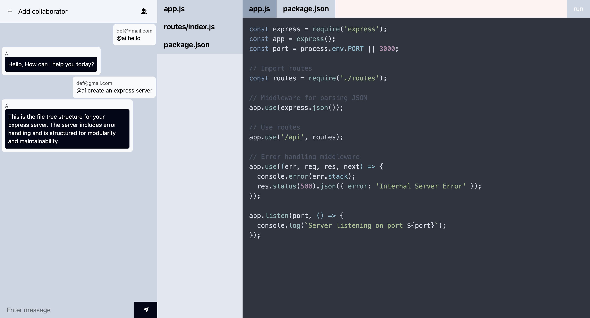

# 🧠 Real-Time Collaborative Chat App with AI Integration

A full-stack real-time collaborative chat application built with the **MERN stack** (MongoDB, Express.js, React.js, Node.js) that allows users to work in project-based rooms with **collaborators**, **live chat**, and **AI-powered assistant** powered by the **Gemini API**.

## 🔥 Features

- 🔒 **User Authentication**
- 👥 **Project-Based Rooms**: Create projects and invite collaborators.
- 💬 **Real-Time Chat** using Socket.IO.
- 🤖 **AI Assistant Integration**: Interact with AI by mentioning `@ai` in chat messages.
- 🧠 **Gemini API**: Uses Google's Gemini for AI-generated responses.
- 🌲 **File Tree & Code Editor**:
  - Create & edit project files with syntax highlighting.
  - AI-generated file trees are directly editable.
- 🖥️ **Live Code Execution**: Spin up an in-browser WebContainer and run your app.
- 🎨 **Markdown + Code Highlighting** in AI responses.

## 🧑‍💻 Tech Stack
- Frontend: React, TailwindCSS, Markdown-to-JSX, Highlight.js
- Backend: Node.js, Express, Socket.IO
- Database: MongoDB with Mongoose
- AI: Gemini API


## 🧠 AI Integration

- Mention `@ai <your prompt>` in the chat.
- The AI interprets your request, possibly returning code and file structures.
- FileTree is updated in real time with AI suggestions.
  

## 🚀 Getting Started

### 🛠️ Prerequisites

- Node.js
- MongoDB
- Gemini API Key

### 📦 Installation

```bash
git clone https://github.com/silkirai1812/realtimeAIChatApp
cd realtimeAIChatApp

```

### 🔐 Backend .env

# chatapp/backend/.env

```bash
MONGO_URI=...
GEMINI_API_KEY=...
JWT_SECRET=...
PORT=5000
```
# chatapp/backend/.env
```bash
VITE_BACKEND_URL=http://localhost:5000
```


## 🧪 Test the App

Once both the frontend and backend servers are running, you can start exploring the features:

### 🔹 1. Create or Join a Project Room
- Navigate to [http://localhost:5173](http://localhost:5173)
- Click on **"New Project"** to create a project room.
- Share the room ID with collaborators so they can join and chat in real time.

### 🔹 2. Real-Time Chat
- Use the chat panel to send and receive messages instantly.
- Messages are synced in real-time using WebSockets (Socket.IO).

### 🔹 3. AI Integration with `@ai` Prompts
- Use `@ai` followed by a prompt to get AI-generated responses.
- Example: `@ai write a Python function to check for a palindrome.`
- The app uses the **Gemini API** to generate AI responses.

### 🔹 4. File Editor & Collaboration
- Browse the file tree on the left sidebar.
- Click a file to open it in the editor.
- Modify file contents; changes are saved and can be shared with collaborators.

### 🔹 5. Run Code in a Web Container
- Click the **Run** button to execute your project code in a live browser container.
- Useful for testing frontend logic or demoing app functionality live.


## 📸 Screenshots
### 💬 Real-time Chat


### 🤖 AI Responses using Gemini API



